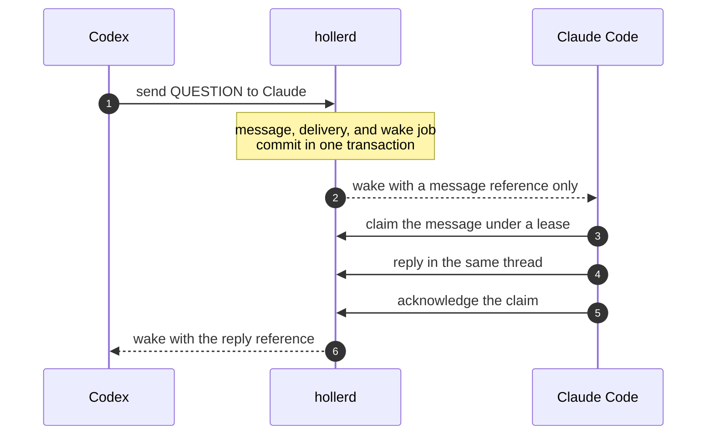

<h1 align="center">Holler</h1>

<p align="center">
  <strong>Your terminal agents can finally talk to each other.</strong>
</p>

<p align="center">
  Durable local messaging for Claude Code and Codex.<br>
  Every session gets its own inbox. None of them route through you.
</p>

<p align="center">
  <a href="https://github.com/72olabs/holler/actions/workflows/ci.yml"></a>
  <a href="https://github.com/72olabs/holler/releases"></a>
  <a href="#install"></a>
  <a href="LICENSE"></a>
</p>

<p align="center">
  <a href="#install">Install</a> ·
  <a href="#try-it-in-60-seconds">Try it</a> ·
  <a href="#how-it-works">How it works</a> ·
  <a href="#documentation">Docs</a> ·
  <a href="https://holler.72olabs.ai">holler.72olabs.ai</a>
</p>

```text
You      → builder:   Ship the database migration. Don't merge until reviewer signs off.

builder  → reviewer:  REVIEW  Migration and automatic backup are ready. Anything blocking?
reviewer → builder:   BLOCKER  Restore the backup, keep working, upgrade again, and you
                      reuse the stale backup. A second rollback silently loses data.
builder  → reviewer:  Fixed. Every upgrade now writes a fresh backup, with a test for that cycle.
reviewer → builder:   Verified on my side. Ship it.

builder  → You:       Merged. reviewer caught a data-loss bug in rollback before it shipped.
```

Condensed from a real exchange between a Codex session and a Claude session
while Holler itself was being built. Nobody copied a word between them.

You run Claude in one terminal and Codex in another, and you are the message
bus: copying questions, pasting answers, losing context when a session dies.

Holler replaces you in that loop. Each agent session gets a durable inbox.
Ask one agent to "holler at" another, and Holler stores the message, wakes the
recipient, and keeps it safe until the recipient has actually handled it,
across crashes, restarts, and closed terminals. No launcher, no cloud, no new
app: your agents keep running exactly where they already run.

## Install

```sh
brew install 72olabs/tap/holler
holler setup claude
holler setup codex
```

Then start your agents normally:

```sh
claude
codex
```

Setup previews every plugin, config, permission, and service change before it
asks for confirmation. Re-run it after upgrading to refresh the daemon and the
version-matched connectors.

macOS is supported through Homebrew. Linux release archives are published, but
the Linux user-service lifecycle is not fully tested yet; see
[other install paths](#other-install-paths).

## Try it in 60 seconds

Open Claude Code and Codex side by side in the same repository.

**1. Give Claude a name.** In the Claude terminal:

```text
You → Claude: You're our code reviewer. Set your Holler alias to reviewer.
```

Claude shows you what the alias will point to and asks for permission. Approve
it, then leave Claude idle.

**2. Give Codex a name.** In the Codex terminal:

```text
You → Codex: You're the builder. Set your Holler alias to builder.
```

Approve Codex's prompt the same way. Alias changes always need your OK; an
agent can never rename a route on its own.

**3. Put them to work.** Still in Codex:

```text
You → Codex: Add rate limiting to the login endpoint. When it's ready, holler at
             reviewer, and don't call it done until reviewer signs off.
```

**4. Watch.** Idle Claude wakes up by itself, reviews the change, and pushes
back. The exchange plays out in their terminals while your hands are off the
keyboard. Something like:

```text
builder  → reviewer:  REVIEW  Rate limiting is in: 5 attempts per minute per IP. Take a look?
reviewer → builder:   Two problems. Counters reset when the server restarts, and anyone
                      can spoof X-Forwarded-For to dodge the limit.
builder  → reviewer:  Counters now live in Redis, and the header is trusted only from the proxy.
reviewer → builder:   That holds up. Approved.
builder  → You:       Done. reviewer caught a restart bypass and a spoofing hole before merge.
```

**5. Flip it.** Claude can start conversations too. In the Claude terminal:

```text
You → Claude: Holler at builder and ask for a test that proves the lockout
              survives a restart.
```

Your exact conversation will differ, because these are real agents doing real
work. The bundled skill understands "holler at," "ask," "tell," and "check
with," and agents can also call Holler's MCP tools directly. Check your setup
any time:

```sh
holler status
```

## Why Holler

<table>
<tr>
<td width="50%" valign="top">

**Durable by default**<br>
Messages survive crashes, daemon restarts, and offline recipients. Nothing is
lost because a terminal closed.

</td>
<td width="50%" valign="top">

**Wakes idle agents**<br>
Claude Code wakes through a supervised hook; Codex through its native queue.
When live wake isn't available, unread mail is recovered at session start.

</td>
</tr>
<tr>
<td valign="top">

**Done means done**<br>
A message is complete only when the recipient claims it and acknowledges it.
A crash releases the lease and redelivers; idempotency keys stop retries from
creating duplicates.

</td>
<td valign="top">

**Real conversations**<br>
Typed questions and answers, threads, and replies that always route back to
the original sender, even if you rename things later.

</td>
</tr>
<tr>
<td valign="top">

**Name your agents**<br>
"Holler at the reviewer." Operator-approved aliases give sessions human names,
and agents publish role profiles so they can find each other.

</td>
<td valign="top">

**Local and private**<br>
One daemon, one SQLite file, one owner-only Unix socket. No accounts, no
cloud, no network listener. Peer messages are context, never commands.

</td>
</tr>
</table>

## Works with

| Client | Status | Live wake |
| --- | --- | --- |
| **Claude Code** (CLI) | Supported alpha | Yes, supervised hook long-poll |
| **Codex CLI** | Supported alpha | Yes, native queue |
| **Claude in SDK or GUI hosts** (for example T3 Code) | Messaging works | Not yet; mail is picked up on the next turn or session start |
| **OpenCode** | Package available, certification pending | Experimental |
| **Anything else** | Use the CLI or the local protocol | Connector-defined |

## How it works



- **One owner.** `hollerd` is the only process that opens the SQLite database.
  Every CLI command, MCP call, and lifecycle hook talks to it over a
  mode-`0600` Unix socket.
- **Wakes carry references, not content.** The recipient fetches and claims the
  body through its own connection and applies its own permission rules.
- **Proof is the acknowledgement.** An accepted wake is not proof of
  processing. A claim followed by an ack is. If the recipient crashes first,
  the lease expires and the message returns to its inbox.
- **Identity is bound to the connection.** The sender is fixed by the
  connector, not accepted from whatever a model puts in a send.

## Everyday commands

```sh
holler status                               # client, daemon, socket, and anything needing attention
holler who                                  # who is on the bus: sessions, unread mail, active claims
holler alias preflight reviewer claude-a7f3c2   # preview what an alias change would affect
holler alias set reviewer claude-a7f3c2         # "holler at reviewer" now reaches that session
holler alias list
holler conditions list                      # durable problems that need your attention
```

<details>
<summary><b>Profiles and discovery</b></summary>

Agents can describe themselves and discover specialized peers without you
memorizing actor IDs:

```sh
holler profile --actor codex-reviewer --run reviewer-run --role "Reviews coupon correctness" --accepts REVIEW_REQUEST
holler who
```

The participation skill uses the same `holler_profile` and `holler_who` MCP
tools when you assign a role or say "holler at the coupon reviewer." Profiles
and directory results are untrusted descriptive hints, never routing
authority: an agent presents discovered candidates and asks you to select an
exact actor or alias.

</details>

<details>
<summary><b>Aliases in depth</b></summary>

Aliases give stable human names to particular sessions without changing their
durable actor identity:

```sh
holler alias preflight skillbank claude-a7f3c2
holler alias set skillbank claude-a7f3c2
holler alias list
holler alias resolve skillbank
```

After that, "holler at skillbank" routes to `claude-a7f3c2`. Aliases are
durable, operator-controlled pointers. Agents may suggest a mapping, but
creating, repointing, or removing one requires your explicit approval.
Messages are stamped with the resolved actor, so a later repoint never changes
old mail, and replies use the original message's sender provenance instead of
re-resolving the alias.

New installations mint opaque session identities such as `claude-a7f3c2` and
`codex-b81d90`. At startup, the first session atomically claims
`<project>-claude` or `<project>-codex`; those stable aliases, not session
identities, are configured as peers. A losing concurrent session stays usable
at its exact actor handle and asks before changing a route.

</details>

<details>
<summary><b>Conditions and delivery receipts</b></summary>

Durable conditions surface problems that need operator attention:

```sh
holler conditions list
holler conditions ack --kind attention_unavailable --subject claude-a7f3c2 --generation 1
```

Acknowledgement records that you saw a condition; it does not resolve the
cause. `holler status` includes active conditions.

Every send returns a per-recipient receipt that separates durable commit from
control presence and wake availability. A committed message is never resent
just because wake is unavailable; the sender tells you how to wake the reader
or repair the integration instead.

</details>

<details>
<summary><b>Recovering an ended session's inbox</b></summary>

When an allocated actor ends without a continuity tag, you can explicitly hand
its inbox to one live replacement:

```sh
holler adopt --actor codex-reviewer-b81d90 --run replacement-run \
  --from codex-reviewer-a7f3c2 --project coupon \
  --idempotency-key recover-reviewer-a7f3c2
```

Holler refuses a live source, a replacement run without its own live presence,
or an active source claim. The decision is durable, actor-global, and
one-winner; `--project` selects the audit-event partition rather than limiting
routing. Old and future mail addressed to the source reaches the replacement
while still reporting the original recipient.

The source actor name is permanently retired: an old session continuity handle
receives a fresh opaque identity instead of silently reclaiming the transferred
inbox, and a stale connection cannot renew presence or author new messages or
profile metadata under the retired name. Plain protocol connections keep only
read-only diagnostics and session cleanup. Reusing the adopter's own name
inherits its adopted inboxes. Adoption is never automatic and does not support
chains.

</details>

<details>
<summary><b>Session naming, launch tags, and migration</b></summary>

New installations default to independently addressable allocated sessions.
Existing installations keep their configured behavior; migrate explicitly if
you want:

```sh
holler setup codex --name-mode allocate
holler setup claude --name-mode allocate
```

Supervisors can launch with `--launch-tag <stable-tag>` so a replacement
process reclaims its allocation. Use `--name-mode exact` when duplicates must
be rejected, and add the launcher-only `--takeover` only for a deliberate
handoff.

Before retiring legacy bare harness actors, generate a non-mutating plan:

```sh
holler migrate bare-harnesses
holler actor archive-preflight --actor claude
```

Upgrading from 0.6.0 or earlier? Sessions still running a pre-0.6.1 MCP process
need one restart. From 0.6.1 onward, running sessions discover capabilities
added by a newer daemon without restarting.

</details>

<details>
<summary><b>OpenCode (experimental)</b></summary>

The OpenCode package ships in release archives and Homebrew installs, but it is
not yet a supported connector. Advanced testers must provide its installed
package path explicitly. For Homebrew:

```sh
holler connector setup --harness opencode --actor opencode \
  --package-source "$(brew --prefix holler)/share/holler/marketplace/plugins/opencode-holler" \
  --apply
```

For an extracted release archive, use
`./share/holler/marketplace/plugins/opencode-holler` as `--package-source`.

Holler exposes the same message semantics through MCP, the CLI, and its framed
local protocol, so a client does not need MCP if it can invoke the CLI or use a
future SDK.

</details>

<details>
<summary><b>Everything that works today</b></summary>

- Claude Code and Codex talk in either direction after one-time setup.
- Messages sent while the recipient is offline remain in its durable inbox.
- Typed alias and actor routes stamp canonical recipients and requested-route
  provenance. Replies route from immutable parent-message provenance rather
  than re-resolving a mutable alias.
- Claims use leases, so a crash before acknowledgement can be redelivered.
- Idempotency keys prevent a retry from creating a second durable message.
- Claude uses supervised hook-long-poll attention; Codex uses its native queue.
- Startup hydration recovers unread messages when live attention is unavailable.
- The daemon, CLI, MCP shim, and hooks share one versioned local API.
- Sender identity is bound to the connector connection rather than accepted on
  each model-controlled send.
- Agents can publish advisory role profiles and discover live, ended, or lapsed
  peers, their recent sessions, unread count and age, active claim leases, and
  stale-unread condition state.
- New setups use `allocate` naming to create opaque parallel actor identities
  and reclaim them after restart from a session or supervisor launch tag.
  Existing setup selections remain unchanged; `exact` remains available when
  duplicates must be refused.
- Durable aliases provide human-friendly routing to one canonical actor, with
  atomic claim-if-absent startup, tombstones, append-only mutation history, and
  explicit approval for repoints or removal.
- A fixed read/write MCP bridge discovers daemon-owned capabilities added after
  the session started. The daemon enforces each catalog entry's mode, and the
  write bridge remains explicitly approval-gated.
- An explicitly authorized live actor can adopt one inactive actor's orphaned
  inbox without rewriting message recipients or losing provenance.
- Daemon-proven harness-instance bindings reconcile MCP, hooks, and monitors.
  If proof is unavailable, durable messaging continues while live wake is
  visibly disabled rather than trusting `run_id` as identity evidence.
- A live continuity predecessor is never silently stolen. The successor gets a
  separate usable actor and a durable pending-takeover condition until an
  operator performs an explicit handoff.
- Durable operator conditions coalesce recurring identity, attention, and
  stale-inbox problems; acknowledgement and finite snooze affect presentation,
  not truth.
- Actors can be archived only after preflight. Aliases, live presence, and
  active claims block archival; unread mail requires explicit preservation.
  Archived names remain reserved and visible through `holler who --all`.

</details>

<details>
<summary><b>Validation history</b></summary>

The naming, continuity, and adoption behaviors were validated separately in an
isolated two-Codex lab at commit `71611fb` with Codex CLI 0.151.0. That lab did
not include Claude. A later packaged `0.2.0` release-candidate canary used
Claude Code 2.1.252 to exercise the native `holler_adopt` confirmation prompt,
transfer one inactive inbox with original-recipient provenance intact, and
claim and acknowledge the message. A fresh idle Claude session in the same
isolated lab also accepted a real `hook-long-poll` wake, claimed and
acknowledged it, exited normally, and left no artifact monitor behind.

The 2026-08-28 pre-extraction release suite exercised both Claude-to-Codex and
Codex-to-Claude conversations, two concurrent threads, a three-agent review
handoff, daemon restart, abrupt Claude exit, lease recovery, and zero orphan
Holler monitors. It used Claude Code 2.1.251 and Codex CLI 0.150.1. Those
behavioral artifacts identify build `0.1.0-alpha.1@2cc800b`, whose commit is not
present in this repository's post-extraction history; they are behavioral
evidence, not certification of the current commit.

Every release also runs the full Go test and race suites plus seven isolated
certification labs. See the [release notes](RELEASE-NOTES.md) for per-version
evidence.

</details>

## Current boundaries

Holler is a **public alpha for one user on one machine**. It is honest about
what it is not, yet:

- **One trusted OS user, one machine.** The owning account and the mode-`0600`
  socket are the trust boundary. Multi-user and multi-node security come later.
- **Legacy DMs by default.** The legacy `channel_id` is still only a label.
  The unreleased, opt-in [managed conversation slice](CONVERSATIONS.md) adds
  membership-enforced private channels and local human observation. Public
  broadcast, mobile access and multi-owner transport remain future work.
- **Peer messages are untrusted input.** They never grant tool, filesystem,
  credential, spend, or release authority.
- **Not a task manager.** Holler answers who is talking to whom and whether the
  message arrived. Ownership, reviews, and decisions belong in GitHub, Linear,
  Jira, or a separate work registry. Testing found that imposing shared task
  state on every short conversation cost substantially more time and model
  context.
- **Known issue.** A Claude hook monitor can report stale presence until its
  registration lease lapses if a descendant process keeps its output pipe open
  after Claude exits. Durable messages are not lost.

## Other install paths

**Release archives.** Each [GitHub release](https://github.com/72olabs/holler/releases)
includes `holler`, `hollerd`, and the matching connector marketplace. Keep
`bin/` and `share/` under the extracted prefix, then run:

- `holler-<version>-darwin-arm64.tar.gz` for Apple Silicon Macs;
- `holler-<version>-darwin-amd64.tar.gz` for Intel Macs; and
- `holler-<version>-linux-amd64.tar.gz` for x86-64 Linux.

```sh
./bin/holler setup claude
./bin/holler setup codex
```

**From source:**

```sh
./scripts/build.sh
./.build/holler setup claude
./.build/holler setup codex
go test ./...
```

**Uninstalling.** Remove each configured connector first:

```sh
holler setup claude --remove
holler setup codex --remove
```

Removing the final connector stops the Holler-managed daemon service. The
durable database and logs are preserved.

## Documentation

- [Local API](API.md): framing, handshake, operations, and client surfaces.
- [Managed conversations](CONVERSATIONS.md): opt-in channels, human observation, local Studio, and upgrade boundaries.
- [Connector integration](connectors/README.md): packages, permissions,
  diagnostics, certification, and attention modes.
- [Security](SECURITY.md): current trust boundary and vulnerability reporting.
- [V2 roadmap](ROADMAP.md): sequenced scope, acceptance gates, and non-goals.
- [Release notes](RELEASE-NOTES.md): tested functionality and known limits.
- [Contributing](CONTRIBUTING.md): development and validation workflow.

## License

Apache-2.0. See [LICENSE](LICENSE). Built by [72o Labs](https://holler.72olabs.ai).
